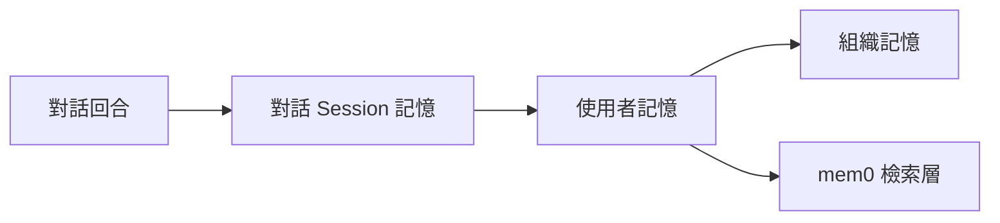

# mem0 如何組織記憶

mem0 將記憶分為不同層級，以便代理在正確的時間記住正確的細節。您可以將其想像成一本筆記本：用便利貼記錄當前任務，用日誌記錄對話過程，並用檔案庫記錄使用者分享過的所有資訊。

<Info>
  **為什麼這很重要**
  - 保持對話連貫，無需重複指令。
  - 讓代理根據長期偏好提供個人化回應。
  - 透過將記憶限制在正確的層級，避免過度抓取數據。
</Info>

## 關鍵術語

- **對話記憶 (Conversation memory)** – 單次對話回合中正在處理的訊息（剛才說過的話）。
- **對話 (Session) 記憶 (Session memory)** – 僅適用於當前任務或頻道的短期事實。
- **使用者記憶 (User memory)** – 與個人、帳號或工作區綁定的長期知識。
- **組織記憶 (Organizational memory)** – 多個代理或團隊可用的共享上下文。



## 短期記憶 vs 長期記憶

短期記憶負責保持當前對話的連貫性。它包含：

- **對話歷史 (Conversation history)** – 按順序排列的近期對話回合，讓代理記住剛才說過的話。
- **工作記憶 (Working memory)** – 臨時狀態，例如工具輸出或中間計算結果。
- **注意力上下文 (Attention context)** – 助手的即時焦點，類似於人類在說話中途腦中保留的資訊。

長期記憶跨對話保存知識。它捕捉：

- **事實性記憶 (Factual memory)** – 使用者偏好、帳號細節和領域事實。
- **情節性記憶 (Episodic memory)** – 過往互動或已完成任務的摘要。
- **語義性記憶 (Semantic memory)** – 概念之間的關係，以便代理稍後進行推理。

mem0 將這些經典分類映射到其分層儲存中，您可以決定哪些資訊應快速淡忘，哪些應保留數月之久。

## 它是如何運作的？

mem0 分開儲存每個層級，並在您查詢時進行合併：

1. **捕捉 (Capture)** – 在對話回合進行期間，訊息進入對話層。
2. **提升 (Promote)** – 根據您的 `user_id`、`session_id` 和元數據，將相關細節持久化到對話 (Session) 或使用者記憶中。
3. **檢索 (Retrieve)** – 搜尋流水線會從所有層級抓取資訊，優先對使用者記憶進行排序，其次是對話筆記，最後是原始歷史記錄。

```python
import os

from mem0 import Memory

memory = Memory(api_key=os.environ["MEM0_API_KEY"])

# 便利貼：對話記憶
memory.add(
    ["我是 Alex，我偏好精品酒店。"],
    user_id="alex",
    session_id="trip-planning-2025",
)

# 在對話稍後階段，獲取長期 + 對話上下文
results = memory.search(
    "有任何飯店偏好嗎？",
    user_id="alex",
    session_id="trip-planning-2025",
)
```

<Tip>
  當您希望短期上下文自動過期時，請使用 `session_id`；若要實現持久的個人化，請依賴 `user_id`。
</Tip>

## 何時該使用各個層級？

- **對話記憶** – 僅在當前對話回合中有意義的工具呼叫或思考鏈 (Chain-of-thought)。
- **對話 (Session) 記憶** – 多步驟任務（例如：入職流程、除錯環節），應在完成後重置。
- **使用者記憶** – 必須跨多次互動持久化的個人偏好、帳號狀態或合規細節。
- **組織記憶** – 每個代理都應能檢索的共享問答 (FAQ)、產品型錄或政策。

## 層級比較

| 層級 | 存續時間 | 短期或長期 | 最佳用途 | 權衡 |
| --- | --- | --- | --- | --- |
| 對話 | 單次回應 | 短期 | 工具執行細節 | 對話回合結束後即消失 |
| 對話 (Session) | 分鐘至小時 | 短期 | 多步驟流程 | 完成後需手動清除 |
| 使用者 | 數週至永久 | 長期 | 個人化 | 需要徵得同意/治理 |
| 組織 (Org) | 全域配置 | 長期 | 共享知識 | 需要擁有者維持更新 |

<Warning>
  避免在使用者或組織記憶中儲存密鑰或未遮蔽的個人識別資訊 (PII)——mem0 的設計初衷就是為了可檢索性。請先對敏感數值進行加密或雜湊處理。
</Warning>

## 開始實踐

- 參考 <Link href="/core-concepts/memory-operations/add_zh_TW">新增記憶</Link> 指南來持久化使用者偏好。
- 遵循 <Link href="/platform/advanced-memory-operations_zh_TW">進階記憶操作</Link> 來調優元數據與圖形寫入。

## 查看實際應用

- <Link href="/cookbooks/companions/ai-tutor_zh_TW">使用 mem0 的 AI 導師</Link> 展示了對話 (Session) vs 使用者記憶的實際運作。
- <Link href="/cookbooks/operations/support-inbox_zh_TW">使用 mem0 的支援收件匣</Link> 示範了共享的組織記憶。

{/* DEBUG: verify CTA targets */}

<CardGroup cols={2}>
  <Card
    title="探索記憶操作"
    description="接下來深入了解 新增/搜尋/更新/刪除 等概念。"
    icon="circle-check"
    href="/core-concepts/memory-operations/add_zh_TW"
  />
  <Card
    title="查看範例食譜"
    description="在客戶支援代理中應用分層記憶。"
    icon="rocket"
    href="/cookbooks/operations/support-inbox_zh_TW"
  />
</CardGroup>
